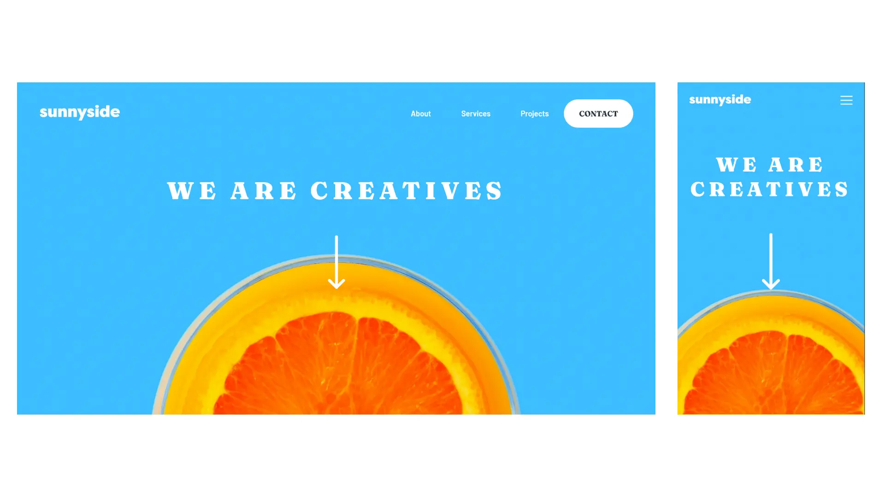

# Frontend Mentor - Sunnyside agency landing page solution

This is a solution to the [Sunnyside agency landing page challenge on Frontend Mentor](https://www.frontendmentor.io/challenges/sunnyside-agency-landing-page-7yVs3B6ef). Frontend Mentor challenges help you improve your coding skills by building realistic projects.

## Table of contents

- [Overview](#overview)
  - [The challenge](#the-challenge)
  - [Screenshot](#screenshot)
  - [Links](#links)
- [My process](#my-process)
  - [Built with](#built-with)
  - [What I learned](#what-i-learned)
  - [Continued development](#continued-development)
  - [Useful resources](#useful-resources)
- [Author](#author)
- [Acknowledgments](#acknowledgments)

## Overview

### The challenge

Users should be able to:

- View the optimal layout for the site depending on their device's screen size
- See hover states for all interactive elements on the page

### Screenshot



### Links

- Solution URL: [Solution on Frontend Mentor](https://www.frontendmentor.io/solutions/responsive-landing-page-using-sass-grid-and-flexbox-Bypgc4PHq)
- Live Site URL: [Sunnyside Agency](https://sunnyside-leandro.netlify.app/)

## My process

### Built with

- Semantic HTML5 markup
- SCSS/Sass
- Flexbox
- CSS Grid
- JavaScript
- Mobile-first workflow
- [Parcel](https://parceljs.org/) - Web application bundler

### What I learned

I decided to use [Sass](https://sass-lang.com/) in this project as I need to practice it and I learned some new tricks and now I understand a lot better the power Sass has when building a style system. I used the mixin below from [Jakub Górowski](https://levelup.gitconnected.com/the-easier-way-to-write-media-queries-with-scss-mixin-c7c956150551) for writting my media queries in SCSS and that was really interesting.

```scss
@mixin minMedia($propertyName, $defaultValue, $mediaQueries: ()) {
  #{$propertyName}: #{$defaultValue};

  @each $breakpoint, $value in $mediaQueries {
    @media (min-width: #{$breakpoint}) {
      #{$propertyName}: #{$value};
    }
  }
}
```

### Continued development

I really enjoyed working with SCSS again and I want to learn more about it. I am also planning to try Tailwind CSS and that's probably the next tool I'll add to my set of skills.

I know I also need to improve my Semantic HTML and I am already on it. I am studying how to implement [ARIA](https://developer.mozilla.org/en-US/docs/Web/Accessibility/ARIA) to make my websites more accesible.

### Useful resources

- [The HTML picture element explained [ Images on the web part 3 ]](https://youtu.be/Rik3gHT24AM) - This helped me for loading different images depending on the media queries. I really liked this pattern and will use it going forward.
- [10 modern layouts in 1 line of CSS](https://youtu.be/qm0IfG1GyZU) - This is an amazing video which helped me understand better the grid system. I'd recommend it to anyone still learning this concept.

## Author

- Frontend Mentor - [@leandroreiz](https://www.frontendmentor.io/profile/leandroreiz)
- Twitter - [@LeandroFontana\_](https://twitter.com/LeandroFontana_)

## Acknowledgments

I'd like to say thank you to my wife that understands me and support my decision to spend my free time to study and pursue a dream to become a front-end developer. I'd also say thank you to Alexandre Germano, a friend that gave me feedback during the process.
